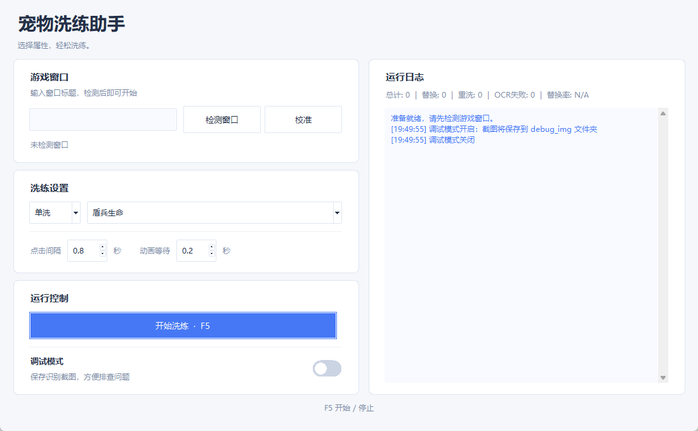

# 无尽冬日 / 寒霜启示录 宠物洗练助手 | Whiteout Survival Pet Refine Helper

Windows 桌面宠物洗练工具，使用屏幕截图、OCR 和鼠标点击完成洗练。支持单洗、双洗、三洗，替换后核对总属性，并在单洗达到上限时自动停止。

Windows pet refinement assistant with a clean white desktop UI, OCR verification, single/dual/triple-stat modes, and automatic stopping when the selected single stat reaches its cap.

[中文使用说明](#下载与启动推荐) · [English guide](docs/README.en.md) · [Downloads / 下载](https://github.com/zha-qd/pet-refine-helper/releases)



## 下载与启动（推荐）

1. 在本仓库 **Releases** 下载 `pet-refine-helper-v1.0.0-windows-x64.zip`。
2. **完整解压**到可写目录，例如 `D:\PetRefineHelper`，不要直接在压缩包里运行。
3. 双击 `start.bat`。便携包附带 Python 环境和 OCR 模型，不需要先安装 Python。
4. 等待 OCR 初始化完成。首次打开可能比后续慢。
5. 打开游戏宠物洗练页面，输入游戏窗口标题，点击“检测窗口”。默认标题为空，每次打开自行输入。
6. 确认检测到了正确窗口，再点击“校准”，观察鼠标是否移到对应按钮。校准只移动鼠标，不会修改识别坐标，也不会自动学习布局。
7. 选择模式和属性，点击“开始洗炼”或按 **F5**。再次按 **F5** 停止。

GitHub 自动提供的 `Source code (zip)` 只有源码，**不包含 Python 环境和 OCR 模型**，不能当作便携包直接使用。

## 适用环境

- Windows 64 位，当前便携环境使用 Python 3.10、PaddleOCR 2.7.0.3、PaddlePaddle 2.6.2。
- 针对本项目校准过的竖屏宠物洗练界面；其他游戏、界面版本或布局不保证兼容。
- 使用实际桌面截图，游戏窗口需要可见、无遮挡、非最小化；开始后不要移动、缩放或切换窗口。
- 不支持后台点击。运行期间程序会控制鼠标，因此优先使用 **F5** 停止。
- 先用少量洗练确认识别、坐标、替换核验均正常，再长时间运行。
- 普通权限启动即可；窗口权限不同或缩放设置不一致时可能影响识别与点击。

## 界面和快捷键

| 项目 | 说明 |
| --- | --- |
| 窗口标题 | 输入目标窗口标题或其中一段；有多个匹配时程序使用第一个，请输入足够明确的标题 |
| 检测窗口 | 获取窗口位置、大小以及比例；不会自动把游戏移到前台 |
| 校准 | 依次移动鼠标到洗练、替换、重洗、确认坐标，帮助检查；仅在停止状态使用 |
| 点击间隔 | 点击后的等待时间，默认 0.8 秒 |
| 动画等待 | 读取变化值前等待动画，默认 0.2 秒 |
| 开始／停止 | 同一个按钮切换状态 |
| F5 | 全局开始／停止，长按不会反复切换 |
| 调试模式 | 将变化值区域截图与处理图保存至 `debug_img`，便于排查 OCR |
| 运行日志 | 显示每轮序号、变化值、替换／重洗判断、核验结果与停止总结 |

没有 P 暂停、S 统计、ESC 退出快捷键。正常关闭使用窗口右上角关闭按钮；建议先 F5 停止并等待总结输出。

## 洗练规则

### 单洗

可选盾兵生命、射手穿透、射手生命、矛兵生命、矛兵穿透。

- 变化值大于零：替换并核验。
- 变化值为零或小于零：重洗。
- 没有检测到红绿文字：按“无变化”处理，这是当前版本保留的行为。
- 开始前发现当前值等于上限，或已核验的替换达到上限：自动停止。

### 双洗和三洗

| 模式 | 参与判断与统计的属性 |
| --- | --- |
| 射手双洗 | 盾兵生命、射手穿透 |
| 矛兵双洗 | 盾兵生命、矛兵穿透 |
| 射手三洗 | 盾兵生命、射手穿透、射手生命 |
| 矛兵三洗 | 盾兵生命、矛兵生命、矛兵穿透 |

**所选属性变化值合计大于零就替换**，否则重洗。不是要求每个属性都增加，所以某项可能下降。双洗、三洗没有“某项满值即停止”的规则。

运行开始时固定本轮模式；运行中修改下拉选项不会改变当前任务，停止后重新开始才生效。不要运行中校准或更换游戏窗口。

## 替换核验和满值停止

程序先读取 `当前值%/上限%`，要求连续两次读数一致，然后识别变化值。

例如：

```text
替换前：33.75% / 44.69%
变化值：+0.12%
预期值：33.87% / 44.69%
```

点击替换和确认后，重新读取总属性。所有所选属性必须连续两次与预期一致，才算核验成功。对显示到小数点后两位的数值，程序使用整数百分之一百分点比较；达到上限时预期值截断为上限。

- 核验会进行有限次数的重读，以等待画面更新。
- 核验失败会停止，本次不计入累计；请检查实际游戏数值，**不要把未核验等同于替换肯定没发生**。
- 核验属于屏幕读数校验，不能证明不存在任何延迟或 OCR 误差。
- 单洗已到 `44.69%/44.69%` 这样的满值时，不再继续消耗洗练材料。

## 停止与统计

F5 停止会阻止后续洗练／重洗。若已经点击替换并打开确认框，会完成该次确认和有限次数的读数核验，再输出总结，因此“正在停止”可能持续几秒。

顶部仍显示总次数、替换、重洗、OCR 失败和替换率。总次数为已完成并记录的处理轮次，OCR 重读不额外计次；OCR 失败按属性识别失败累计，口径与轮次不同。

停止日志仅汇总**已核验替换的正向属性增加**，例如：

```text
本轮属性累计增加（仅计已替换结果的正值）
  盾兵生命: +1.25 个百分点
  射手穿透: +0.86 个百分点
```

33.75% → 33.87% 是增加 0.12 个百分点。重洗、未通过核验的结果不计入；达到上限时只计算实际增加的部分。双洗／三洗中的负向变化不会从累计正值扣除，所以此总结**不是最终净提升**。每次重新开始会重置本轮累计。

## 常见问题

### 无法启动／窗口一闪而过

先确认完整解压，`runtime` 文件夹与 `start.bat` 在同一级。查看 `logs/startup.log`，或运行 `debug_run.bat` 查看控制台错误。不要只复制一个 `.py` 或 `.bat` 文件到其他地方。

### 找不到游戏窗口

窗口标题必须自行填写，不能留空；输入任务栏或模拟器标题栏中可见的标题片段。多个匹配时缩小匹配范围。

### “当前属性数值未能稳定识别”

检查是否停在正确的宠物洗练页面、数值是否被遮挡、窗口比例是否一致。总属性会重读数次，仍无法稳定读取就停止。不同皮肤、字体、分辨率或缩放可能需要重新校准代码中的区域。

### 连续三次变化值识别失败

检查画面和动画速度，可适当增加点击间隔与动画等待。开启调试模式查看截图。没有红绿文字会按无变化处理，不会因此累计 OCR 失败。

### 替换核验失败

可能是点击未生效、动画尚未结束、总属性区域偏移或 OCR 数值不一致。检查游戏中的当前值后再决定是否重新开始，程序不会自动重复替换。

### 校准位置不准

见 [坐标与识别说明](docs/coordinates.md)。当前“校准”是检查动作，不是自动修正。保持窗口比例一致；如按钮布局变了，需要修改坐标。

### F5 没反应／鼠标控制冲突

确认助手仍在运行，只启动一个实例，并关闭占用 F5 或控制鼠标的其他脚本。停止收尾阶段会暂时禁用开始，等日志总结输出后再按 F5。

### 日志、截图保存在哪里

启动日志位于应用目录的 `logs/startup.log`，每次启动覆盖。调试图在 `debug_img/`；界面运行日志不会自动导出。提交问题前检查日志内容，不需要上传整个运行环境。

## 从源码运行（开发者）

使用 Windows x64 Python 3.10 创建虚拟环境：

```powershell
py -3.10 -m venv .venv
.venv\Scripts\python.exe -m pip install -r requirements.txt
.venv\Scripts\python.exe auto_refine_gui.py
```

推荐优先使用便携包。`requirements.txt` 固定核心依赖，但从源码新安装的传递依赖仍可能变化；已验证便携环境的完整清单在 [runtime-packages.json](docs/runtime-packages.json)。PaddleOCR 3.x 的 API 与本程序不兼容，请勿直接升级。

源码运行若没有 `models/`，PaddleOCR 会按自己的默认行为获取模型，需要联网。便携包提供模型，代码优先使用本地 `models/det`、`models/rec`、`models/cls`。

## 测试与验证范围

```powershell
runtime\python.exe tests\test_verification.py
runtime\python.exe tests\test_logs.py
```

模拟测试覆盖总值解析、连续读数、核验失败停止、单洗满值、上限截断、双洗／三洗、正值累计与日志。发布前还使用提供的两张实际游戏截图验证过五个属性的 OCR；既有版本已由使用者反馈可正常运行。

测试不等于保证所有机器或布局都兼容。当前项目没有跨模拟器、跨 DPI、长时间压力测试。总值识别和按钮定位仍依赖校准过的界面布局。

## 项目文件

```text
auto_refine_gui.py       主程序
bootstrap.py             启动错误日志
start.bat                无控制台启动
debug_run.bat            控制台诊断启动
requirements.txt         源码核心依赖
docs/                    界面、坐标及依赖清单
tests/                   不控制游戏的逻辑测试
runtime/                 便携包附带，不进入 Git 源码
models/                  便携包附带，不进入 Git 源码
```

第三方组件说明见 [THIRD_PARTY_NOTICES.md](THIRD_PARTY_NOTICES.md)，版本变更见 [CHANGELOG.md](CHANGELOG.md)。
